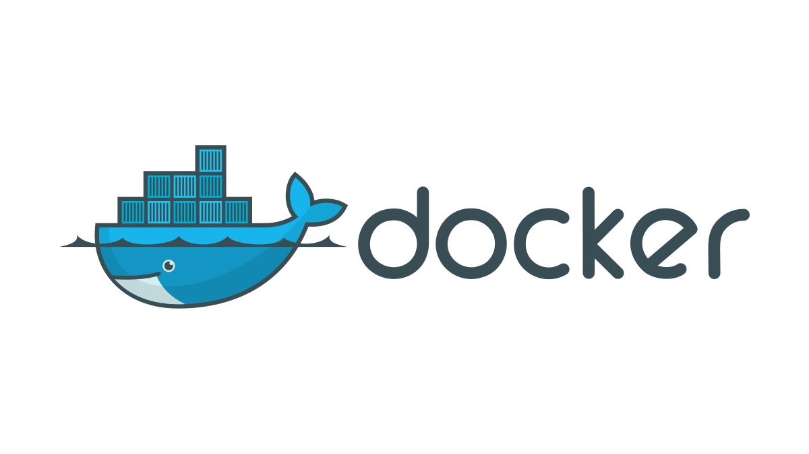
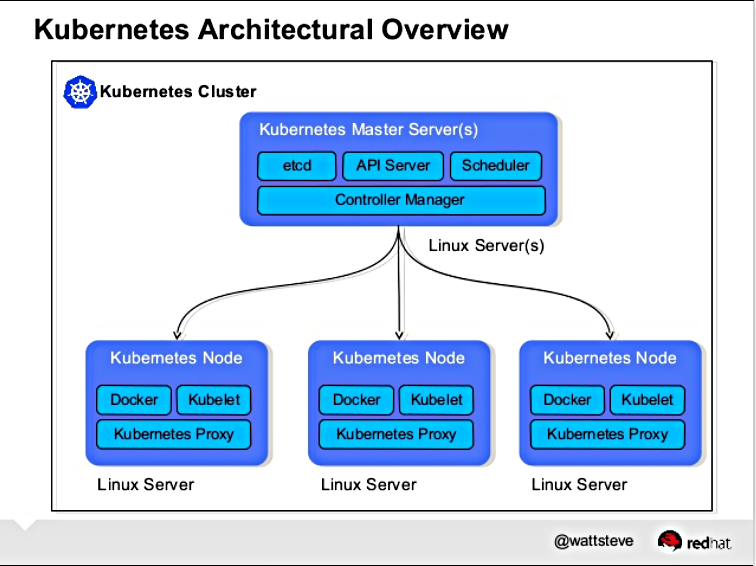
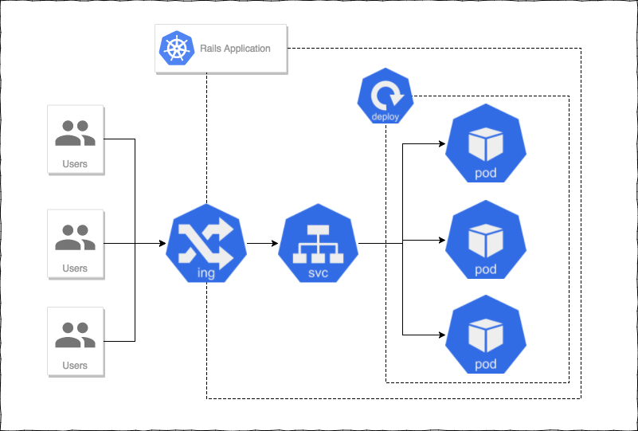

# Scaling __Fisher Price__ Architecture with __Kubernetes__


---


# Jason Carter
## Senior Software Engineer

---


#[fit] mavenlink.com/engineering

---

# Mavenlink Integrations
- Connects third party APIs with Mavenlink
- For example,
  - A company might want to use __Jira__ for _development tasks_ and __Mavenlink__ for _accounting_, _project planning_ and _client collaboration._
  - Mavenlink Integrations lets them _sync_ __Jira__ and __Mavenlink__ so that data flows between both systems.

---


---


---

# Pros
- Dead simple to get started
- Easy deploys
- Some monitoring

---

# Cons
- Resource utilization and cost
- Hard to scale queue based workloads
- Less control over the underlying hardware
- Visibility

---


---

# Why?
- Flexibility
- Better resource usage and scaling
- Cheaper!

---

# Mavenlink :heart: Kubernetes
- Two production applications fully deployed
- Background workers for primary application
- Kubernetes workstations
- Instastage

---

# What's the deal with Fisher Price?


---


---


<!-- Dare Obasanjo (@Carnage4Life) on Twitter, 19 Feb 2018, https://twitter.com/Carnage4Life/status/965737146609905665 -->

---


<!-- Michael Hartl (@mhartl) on Twitter, 19 Feb 2018, https://twitter.com/mhartl/status/965806386599813120 -->

---


<!-- David Heinemeier Hansson (@DHH) on Twitter, 19 Feb 2018, https://twitter.com/dhh/status/965782753491927040 -->

---


---

# Rails isn't the problem...

---

# ...how we're using and deploying it might be.

---


---

# What we'll cover

- A traditional "production" Rails application
- What is Kubernetes and how can it help me scale my application?
- Advanced Kubernetes Concepts

---

# A disclaimer


---

# Lets look at a traditional Rails application...

---

# We'll discuss
- Developing
- Shipping it to _production_

---

# Let's identify some common _scaling_ problems

---

# Developing

---

# Setting up your development environment

---

# Probably went something like this...

- Install packages
- Install languages, frameworks, and tools
- Install dependencies
- Install services (mySQL, Postgres, Redis, ElasticSearch, etc...)

---

# What about replicating this to all of your other developers machines?

---

# Problem 1
### Managing an applications dependencies across development machines is difficult

---

# Shipping it to production
- Need a database
- Need some servers to run my application

---

# Options
- Roll your own servers
- Use Heroku
- Use a cloud service provider

---

# Lets go with a cloud provider for this example...

---


---


---


---

# This quickly becomes quite the chore!
- Maintaining server inventory
- Maintaining deploy and development tooling
- Monitoring
- Rollbacks
- Backups

---

# More problems!

---

# Problem 2
### Keeping development, staging, and production environments the same

---

# Problem 3
### Scaling inventory with demand

---

# Problem 4
### Utilization and cost

---

# Problem 5
### What if I need to deploy and manage more services?

---

# There has to be a better way

---

# Lets start by discussing containers

---

# What's a container anyway?

A container image is a _lightweight_, __stand-alone__, _executable package_ of a piece of software that includes everything needed to run it.

---

## Containers _run anywhere_ and __have everything they need to run__

---



---

# This solves __#1__ and __#2__

---

# But now that I've got a container, how do I deploy and manage them?

---

# What is Kubernetes?

Kubernetes is a portable, extensible open-source platform for managing containerized workloads and services, that facilitates both declarative configuration and automation[^1].

[^1]: [What is Kubernetes?, kubernetes.io](https://kubernetes.io/docs/concepts/overview/what-is-kubernetes/).

---



<sub>Kubernetes Architectural Overview (by Steve Watt, Red Hat).</sub>

---

# Scheduling


<sub>Unsourced :pensive:</sub>

---

# What do I like about Kubernetes?
- Abstractions for thinking about infrastructure
- Don't have to know __too__ much about the underlying hardware
- Trivial scaling
- Very, very, flexible!

---

# How do I get my Rails application on Kubernetes?

---

# 1) Spin up a cluster!

---


---

# 2) Containerize it!

---

```dockerfile
FROM ruby:2.5

USER root
RUN apt-get update && apt-get install -qq -y build-essential nodejs libpq-dev --fix-missing --no-install-recommends

RUN mkdir -p /app
WORKDIR /app

COPY Gemfile Gemfile
COPY Gemfile.lock Gemfile.lock

USER app
RUN RAILS_ENV=production bundle install --jobs=4 --retry=3 --deployment

ENV RAILS_ENV=production

COPY . .

USER root
RUN chown -R app. /app

USER app
CMD ["bundle","exec","rails s"]
```

---

# 3) Put it on Kubernetes

---

## We're going to write some _manifests_ that describe what our application should look like

---

## Deployment
A deployment declares your desired state of an application, usually as a series of pods and how they should be managed

---

## Pod
A pod (as in a pod of whales or pea pod) is a group of one or more containers (such as Docker containers), with shared storage/network, and a specification for how to run the containers.

---

### In laymans terms, pods are units of works or _replicas_ of an application. And deployment describes how to configure them.

---


---

```yaml
apiVersion: extensions/v1beta1
kind: Deployment
metadata:
  name: rails
spec:
  replicas: 3
  template:
    metadata:
      name: rails-pod
      labels:
        service: rails-web
    spec:
      containers:
      - name: rails-container
        image: rails:latest
      restartPolicy: Always
```

---

# What can I do with a deployment?

---

```yaml
# How much resources should we allocate to this pod?
resources:
  requests:
    memory: 1Gi
    cpu: 200m
  limits:
    cpu: 1
    memory: 2Gi
```

---

```yaml
# Environment variables that the pod should have access to
env:
  - name: MY_FAVORITE_COLOR
  value: blue
  - name: SUPER_TOP_SECRET_USERNAME
  valueFrom:
    secretKeyRef:
      name: secret-token
      key: username
```

---

## Service
A service allows other things to access your deployment with a predictable host.

---


---

```yaml
apiVersion: v1
kind: Service
metadata:
  labels:
    service: rails
  name: rails-service
spec:
  type: NodePort
  ports:
  - name: rails-port
    port: 3000
    protocol: TCP
    targetPort: 3000
    nodePort: 30000
  selector:
    service: rails-web
```

---

# This becomes a human readable (and predictable) host

---

#[fit] rails-service.default.svc.cluster.local

---

# What about talking to external services?

---


---

## Ingress
Allows traffic to a given hostname, to route to the correct service

---

# In some cases, like GKE, this even spins up a load balancer for you!

---



---

```yaml
apiVersion: extensions/v1beta1
kind: Ingress
metadata:
  name: rails-web-ingress
spec:
  tls:
    - secretName: my-tls-cert
  rules:
    - host: my-rad-rails-app.com
      http:
        paths:
          - backend:
              serviceName: rails-web-service
              servicePort: rails-port
            path: /*
```

---

# So lets circle back to some of our scaling problems
- Utilization and cost
- Scaling inventory with demand
- What if I need to deploy and manage more services?

---

# Scaling inventory with demand

---

# Lets define inventory
- Servers to run our code on
- Copies of our application

---

# This is often called Horizontal Scaling

---

# Servers to run our code on

---

# Just add more nodes!

---

# Node can be any mixture of machines

---


---

# Node Autoscaler

---

# Scaling copies of our application

---

```
replicas: 3 -> 4
```

---

# It's that easy!

---

# Utilization and cost

---

# Remember resource requests from before?

---

```yaml
# How much resources should we allocate to this pod?
resources:
  requests:
    memory: 1Gi
    cpu: 200m
  limits:
    cpu: 1
    memory: 2Gi
```

---

# Utilization and cost
- Nodes are total _cluster_ capacity
- Replicas are total _application_ capacity
- These can be tweaked to find the right level of utilization

---

# What if I need to deploy and manage more services?

---

# A new service needs
- A docker image
- A deployment
- A service

---

# You can then
- Deploy it separately
- Pass its service url to the Rails App
- Send requests

---

# Since its just a _service_, you can route traffic from inside the cluster without worrying about Ingress

---

# You could also try using gRPC!

---

# Advanced

---

# So this is cool and all, but show me the good stuff!

---

# Autoscaling

---

# We already know we can autoscale nodes, but what about pods?

---

# Horizontal Pod Autoscaler
The Horizontal Pod Autoscaler automatically scales the number of pods in a replication controller, deployment or replica set based on observed CPU utilization.

---


---

```yaml

apiVersion: autoscaling/v1
kind: HorizontalPodAutoscaler
metadata:
  name: rails-hpa
spec:
  maxReplicas: 5
  minReplicas: 3
  scaleTargetRef:
    apiVersion: extensions/v1beta1
    kind: Deployment
    name: rails-web
  targetCPUUtilizationPercentage: 50

```

---

# But thats not always the right thing to scale on...

---

# Custom Metrics

---

# Kubernetes allows you to _extend_ its API

---

# For us,
- Scaling our jobs on the `jobs_per_worker` ratio in the queue
- Scaling our web server on the `http_requests` per minute

---

# Lets look at queues

---

# We need to,
- Collect metrics
- Expose those metrics to Kubernetes
- Have our HPA point at those metrics

---


---


---

# Custom Resource Definitions

---

# Lets think about a worker/queue setup

---

# For every queue,
- I need a worker pool
- I want that worker pool to autoscale

---

# Kubernetes lets us define _custom_ resources to create _new_ abstractions

---

# You need to...
- Define a CustomResourceDefinition
- Implement the controller that says "what do I do to fulfill this resource"

---

```yaml
apiVersion: customResources/v1
kind: Queue
metadata:
 name: jira-queue
spec:
 name: jira
 min: 1
 max: 10
 metric: jobs_per_worker
```

---

# The possibilities are endless
- A `Database` resource that spins up a database in cluster for you
- A `Staging` resource, the configures a staging app with dns behind company firewall

---

# This to me is the true power of Kubernetes

---

# Summing up

---

# Kubernetes faciliates..
- Thinking of infrastructure as code
- Scaling manually and automatically with ease
- Building our own abstractions

---

# How can I learn more?

---

- [noobernetes.io](https://noobernetes.io)
- [Tutorials - Kubernetes](https://kubernetes.io/docs/tutorials/)
- [Getting started with Kubernetes as an Application Developer](https://kubernetes.io/docs/user-journeys/users/application-developer/foundational/#section-2)
- [The Childrens Illustrated Guide to Kubernetes](https://deis.com/blog/2016/kubernetes-illustrated-guide/)

---

# Fin

---
